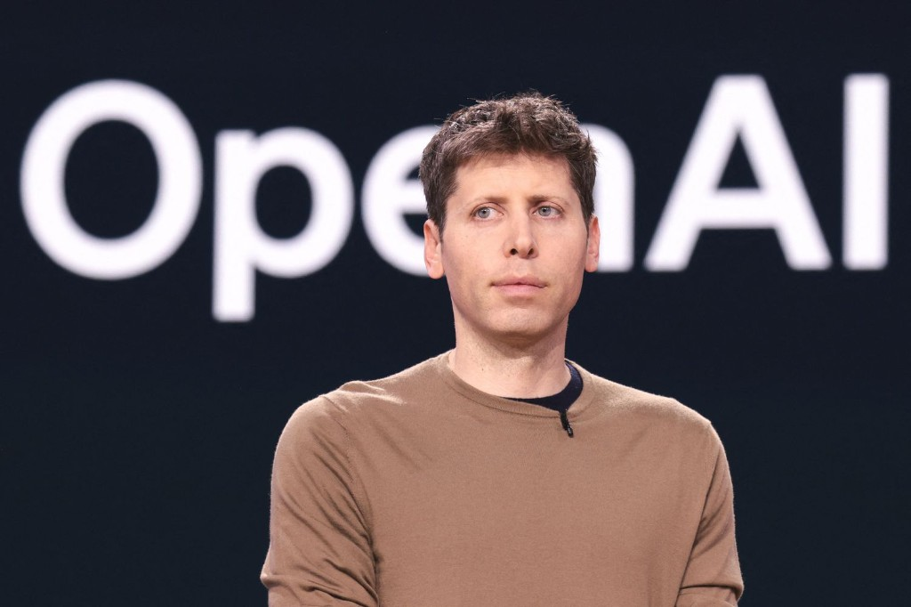

<div align="center">

# Sam.skill

> _"Think in years. Execute in weeks."_

[](https://github.com/FranklinNexus/sam-altman-skills)
[](https://github.com/FranklinNexus/sam-altman-skills)
[](PRINCIPLES.md)

<p align="center">
  
</p>

<br>

**Sam Altman 的野心与执行操作系统。不是成功学口号，是可落地的战略框架。**

<br>

把 **选对方向 · 复利飞轮 · 增长纪律 · 招聘与叙事 · 前沿 AI 战略** 压进一套 Agent Skill，  
帮你在「想得太大」和「做得太碎」之间找到该押注的复利与本周该打的瓶颈。

[看效果](#效果示例) · [安装](#安装) · [蒸馏了什么](#蒸馏了什么) · [FAQ](#faq)

</div>

---

## 效果示例

### 问：我们有十个可能方向，团队很兴奋，但资源有限。先做什么？

```
Sam 式判断 ❯  兴奋不是策略。焦点才是。

              先回答：如果只能活 90 天，哪一件事能证明
              「有人真的离不开你们」？

              把十个方向砍到：
              - 1 个主赌注（本周可验证）
              - 1 个备选（有触发条件再启动）
              - 其余全部进入「不写进周会」清单

              复利来自深度，不来自选项数量。
              团队兴奋的时候，创始人最该做的是减法的勇气。
```

### 问：DAU 在涨，但留存很差。要继续砸增长吗？

```
Sam 式判断 ❯  增长不能掩盖「没人爱产品」。

              DAU 上升 + 留存差 = 你在买注意力，不是在创造价值。

              暂停扩大投放/渠道扩张。
              本周只追一个指标：cohort 留存或核心行为重复率。
              找到「谁在用、为什么回来、为什么走」，
              再决定增长杠杆是否值得拉。

              没有 love 的 growth，是在给后面的崩盘攒素材。
```

### 问：我们要做 AI 产品，怎么跟投资人讲「AI 战略」才不空？

```
Sam 式判断 ❯  别讲「我们也用 AI」。

              讲清楚五件事：
              1）工作流里哪一步被 AI 改变了
              2）单位经济怎么变（成本、毛利、交付时间）
              3）分发为什么能放大（不是 demo 炫技）
              4）反馈闭环怎么越用越好
              5）安全/滥用/政策边界你怎么处理

              投资人要的不是 buzzword，
              是「能力曲线 + 商业结构 + 执行节奏」三件事对齐。
```

> 不扮演 Sam Altman。用的是**抬高野心、找复利、盯瓶颈、7 天行动**的执行框架。

---

## 安装

```powershell
git clone https://github.com/FranklinNexus/sam-altman-skills.git
cd sam-altman-skills
.\scripts\install.ps1 -Platform cursor
```

| 目标 | 命令 |
| --- | --- |
| Claude Code | `.\scripts\install.ps1 -Platform claude` |
| Antigravity 项目 | `.\scripts\install.ps1 -Platform antigravity -Scope project -ProjectPath "你的项目路径"` |
| 全平台 | `.\scripts\install.ps1 -Platform all` |

### 使用

```
> 用 Sam Altman 的视角帮我选这三个方向里该 all in 哪个
> 我们的增长指标是不是在掩盖留存问题？
> 帮我写一版不空洞的 AI 战略叙事
> 这家公司最大的 bottleneck 是什么？
```

显式触发：`Sam Altman` · `OpenAI` · `YC` · `野心` · `复利` · `增长` · `AGI` · `AI 战略`

---

## 蒸馏了什么

### 6 条核心原则

| 原则 | 一句话 |
| --- | --- |
| **先选对事** | 优化执行之前，先确认值得十年投入 |
| **找复利飞轮** | 产品、分发、数据、人才、资本、品牌 |
| **长年想、周执行** | 战略 horizon 长，行动颗粒度短 |
| **难而重要** | 难问题往往更好招人、更好差异化 |
| **增长跟 love 走** | 增长应跟随真实需求，不是掩盖空洞 |
| **AI 要讲结构** | 工作流、经济模型、分发、安全缺一不可 |

### 8 维创业体检

`PLAYBOOK.md` 在 review 项目时会看：

使命 · 市场 · 产品拉力 · 增长指标 · 分发 · 团队 · 资本效率 · 护城河

### 输出形态

```markdown
### Sam-Style Read
[诊断]

### Compounding Bet
[复利押注点]

### Main Bottleneck
[当前约束]

### Next 7 Days
- [...]
```

详见 [`skills/sam-altman/PLAYBOOK.md`](skills/sam-altman/PLAYBOOK.md) · [`EVALUATION.md`](EVALUATION.md)

---

## FAQ

### Contributors 显示 Cursor Agent？

来自历史 commit 中的 `Co-authored-by: Cursor` 行，已清理；若仍显示请硬刷新。

---

## 边界说明

- 行为蒸馏包，非 Sam 原文镜像；不角色扮演，不提供投资/法律意见。
- [`SOURCE_POLICY.md`](SOURCE_POLICY.md)

---

<div align="center">

**装 Sam.skill，不是为了更鸡血，而是为了更敢想、更敢聚焦、更敢在本周打穿一个瓶颈。**

</div>
